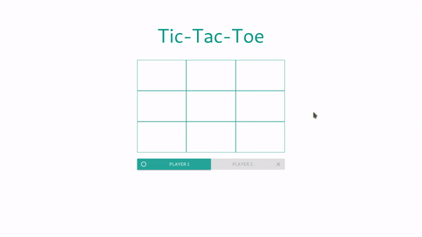

# Vue.js Tic-Tac-Toe Game!

A simple Tic-Tac-Toe Game created with only Vue.js!

## Will be Added Soon

* End game result screen
* Forbid player to replace already filled panel


### How to Run this App
```
npm install
npm run serve
```

### Compiles and Minifies for Production
```
npm run build
```

### Lints and Fixes Files
```
npm run lint
```

## GIF



## Built with

* [Vue.js](https://vuejs.org/) - JavaScript Framework
* [Materialize CSS](https://materializecss.com/) - CSS Framework

## Author

* **Muhammad Daivasmara Denaw** - [Daivasmara](https://github.com/Daivasmara)
